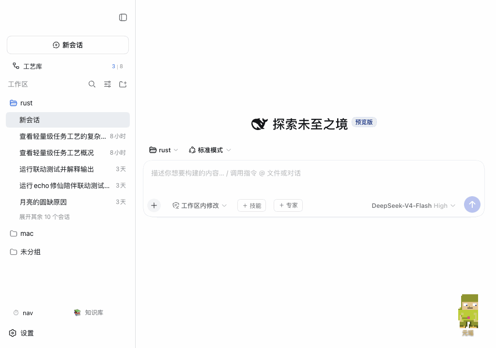

# @weibaohui/dsh-smart-title

[](https://github.com/topics/dsh-plugin)
[](https://www.npmjs.com/package/@weibaohui/dsh-smart-title)

**会话智能标题插件**：用 LLM 自动改写会话标题，告别「第一行」式标题。



## 核心功能

- **全对话总结**：每轮对话结束后，对「用户消息 + 助手回答」的完整转写做一轮总结，标题反映会话真正在做的事，而不是复述第一句话
- **首条消息即时出题**：会话第一条消息到达即出 LLM 标题（接管官方 `first-prompt` 节奏），不用等第一轮结束
- **刷新节流**：距上次标题生成不足最小间隔（默认 2 分钟，可配）就不再重复生成，长会话不再每轮烧一次 LLM；顺带消掉首轮「即时出题 + 回合结束刷新」的背靠背重复
- **长会话冻结**：会话用户消息超过阈值（默认 100，可配）后停止自动刷新——后期主题漂移概率低；启动回填不受冻结影响
- **同题静默跳过**：新生成标题与现标题相同（忽略大小写与空白差异）时不写入，侧栏不闪烁、无失败告警
- **失败自动重试**：官方内置标题提供方请求失败后回退标题会永远残留；本插件每轮结束自动重试刷新
- **手动改名保护**：你在界面上手动改过的标题（用户钉住）绝不被自动覆盖
- **范围可控**：自动跳过子代理会话与 fork 子会话；可开关「是否包含助手回答」
- **启动回填（可选）**：对标题仍是回退文案的活跃会话逐个补刷（默认关闭，可设开启与会话上限）
- **模型可指定**：默认跟随会话当前模型，也可为标题单独指定一条便宜/快速的模型路由

## 安装

```bash
dsh plugin --profile web add @weibaohui/dsh-smart-title -w
```

装完重启 `dsh web` 即生效，无需任何配置。安装时会自动禁用内置的 first-prompt 标题提供方（`session-title` 服务只允许一个提供方，两者不能共存；卸载本插件后内置提供方自动恢复）。

## 使用

1. 装好重启后，正常聊天即可——侧边栏会话标题会在第一轮对话后自动变成总结式标题
2. 想调行为：**设置 → 会话智能标题**——总开关、标题长度、刷新节流间隔、长会话冻结阈值、标题模型路由（provider/model 下拉选择）、范围排除、启动回填等全部可视化，保存即生效
3. 存量会话修复：打开「启动回填」后重启一次实例，插件会对标题仍是回退文案的活跃会话逐个重写（用户手动改过的不动）
4. 也可直接编辑 `~/.dsh/settings.yaml` 的 `dsh-smart-title:` 节，保存后约 2 秒热生效

## 工作原理

- 标题走 dsh 官方 `sessionTitle` 服务的日志事件机制（`session/title`），与本体内建提供方同一写入通道，客户端侧边栏无感知自动刷新
- 本插件注册唯一提供方并接管其 `first-prompt` 自动节奏，另订阅 `session/event` 的 `turn/end`（completed）触发显式刷新
- 每次刷新读取完整会话日志构建转写（用户消息按 seq 归属，助手回答按预算裁剪），经 `ctx.llm` 以 `purpose: session-title` 发起独立辅助请求，不影响主对话上下文与 KV Cache
- turn/end 刷新前过两道闸：`refreshMinIntervalMs`（距上次生成的最小间隔，覆盖官方 first-prompt 首题在内的所有生成路径）与 `refreshMaxTurns`（长会话冻结，回填路径豁免）；生成结果同题时静默返回现值，不产生写入与告警

## 联系我 :飞书群


## 版本兼容性

本插件与 [DeepSeek Harness](https://github.com/deepseek-ai/deepseek-harness)（`@deepseek-ai/dsh`）的版本对应关系：

| 插件版本 | 适配 dsh 版本 | 备注 |
|---------|--------------|------|
| 0.1.5 | 0.1.7-rc.2 | 当前版本；修复宿主将 volatile 字段物化为 {} 导致的设置毒化（saneConfigValues 清洗 + 移除 Config 兼容字符串字段） |
| 0.1.4 | 0.1.7-rc.2 | 当前版本；适配 0.1.7 settings 模型（导出 volatile `Config`，`ctx.settings.update` 持久化），面板改动重启不再丢失 |
| 0.1.3 | 0.1.7-rc.2 | 已在 @deepseek-ai/dsh@0.1.7-rc.2 下验证运行 |

> **发版约定**：每次发布新版本时，请在上表追加一行，记录该插件版本实际验证所用的 `@deepseek-ai/dsh` 版本。`package.json` 的 `engines.dsh` 声明最低支持版本；本表记录实际验证版本，二者配合使用。
